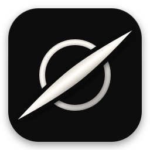
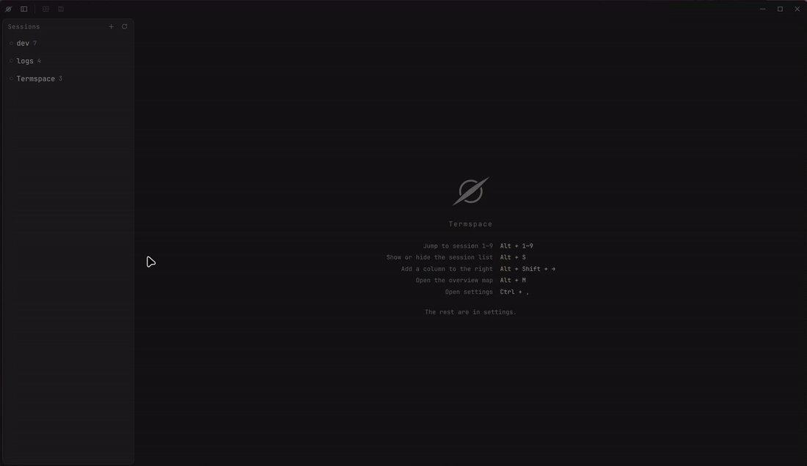

<p align="center">
  
</p>

<h1 align="center">Termspace</h1>

<p align="center">
  A terminal workspace on a horizontal canvas.
</p>

<p align="center">
  <a href="https://github.com/ba2slk/termspace/releases"></a>
  
  
  
</p>

<p align="center"><a href="README.ko.md">한국어</a></p>

<p align="center">
  
</p>

Termspace lays terminal panes out on a canvas **wider than your screen**. Panes
that slide off the edge are still there, just to the side. Move focus and the
view glides over with it.

Shrinking the window never shrinks a pane. A narrow screen shows less of the
canvas; it does not squeeze your editor, logs, and shells into thinner boxes.

The layout is a file. Shape a workspace by hand, save it as YAML, and it comes
back exactly the same tomorrow — same columns, same widths, same commands
running in the same directories.

Everything is one key away. `Alt` + arrows moves focus, `Alt` + `M` shows the whole
canvas, and holding `Alt` names every pane on screen. No prefix key, no mouse
required.

**Useful when** you work on a laptop screen that a real layout doesn't fit,
keep several projects open at once, or run long jobs and agents that finish
while you're looking somewhere else.

**Linux and macOS.** Windows is not supported.

## Features

| Feature | What it does |
|---|---|
| Move focus with `Alt` / `Cmd` + arrows | The pane in that direction takes focus and the canvas scrolls to it. No prefix key, and no window numbers to remember. |
| Columns have fixed pixel widths | A column is a number of pixels, not a share of the window. Resizing the window changes how much of the canvas you can see, not how wide anything is. |
| Overview of the whole session (`Alt` + `M` / `Cmd+Shift+M`) | The entire canvas shrunk to one screen, each card showing the pane's title and what it is running. Arrow keys or a click jump to a pane, and `F2` renames the selected card. |
| Save the current layout as a session | Split panes, `cd` each shell, start the commands, then save. Column widths, pane ratios, each shell's working directory, and the running commands are written to a new YAML file. |
| Sessions are YAML files | One file per session in `~/.config/termspace/sessions/`. The app reads them and never writes back on its own: splitting or resizing at runtime leaves the file alone. Right-clicking a row in the session list renames it: the `name:` field is rewritten and the file is renamed to match, keeping the rest of the file as you wrote it. |
| Reordering the session list | Drag a row up or down to set its place in the list, which is also the order `Alt` + `1`–`9` open. The order is kept in `~/.config/termspace/session-order.json`, next to the app's settings rather than inside `sessions/`. A session not yet dragged sorts by when its file was created. |
| Switching sessions | The wheel over the session list steps through sessions, and `Alt` + `1`–`9` opens one directly. Pressing the current session's number again returns to the previous one. |
| Panning and resizing with the mouse | Mice have no horizontal wheel, so the wheel over the middle of the title bar pans the canvas, as does `Shift` + wheel anywhere. The gaps between panes are drag handles for resizing. |
| Notifications from off-screen panes | A pane that rings marks its session in the list. `OSC 9` and `OSC 777` notifications also reach the desktop, unless you were watching that pane at the time. |

## Install

Builds are on the [releases page](https://github.com/ba2slk/termspace/releases).
Building from source is in [CONTRIBUTING.md](CONTRIBUTING.md).

### Linux

Grab the AppImage:

```bash
chmod +x Termspace-*.AppImage
./Termspace-*.AppImage
```

<details>
<summary>It exits immediately with a sandbox error</summary>

Ubuntu 24.04+ ships an AppArmor policy blocking unprivileged user namespaces,
which Electron's sandbox needs. `--no-sandbox` gets you running; registering a
profile keeps the sandbox on:

```bash
sudo tee /etc/apparmor.d/termspace >/dev/null <<'PROFILE'
abi <abi/4.0>,
include <tunables/global>
profile termspace /home/*/Applications/Termspace.AppImage flags=(unconfined) {
  userns,
  include if exists <local/termspace>
}
PROFILE
sudo apparmor_parser -r /etc/apparmor.d/termspace
```

Renderer isolation and the CSP are in place either way.

</details>

### macOS

Download the dmg for your architecture (`arm64` for Apple Silicon, `x64` for
Intel) from the releases page.

**First launch.** Termspace is ad-hoc code-signed and not notarized, so
Gatekeeper blocks the first open — you may see "damaged" or "unverified
developer". Both mean the download carries macOS's quarantine flag; the file
is intact. Do one of these once:

- **Terminal:** drag Termspace.app to Applications, then
  `xattr -dr com.apple.quarantine /Applications/Termspace.app`
- **No terminal:** double-click (it will be blocked), then System Settings →
  Privacy & Security → "Open Anyway". On macOS 14 and earlier,
  right-click → Open also works.
- **Build from source:** `npm install && npm run dist:mac` — locally built
  apps carry no quarantine flag.

## Sessions

A session is one YAML file. Columns left to right, panes top to bottom:

```yaml
name: dev
cwd: "~/dev/projects/app"     # unquoted ~ is null in YAML — quote it

columns:
  - width: 720                # px; never shrinks with the window
    panes:
      - title: editor
        command: nvim .
      - title: shell
        height: 0.3           # vertical share within the column

  - width: 900
    panes:
      - title: server
        cwd: ./backend        # relative to the session cwd
        command: uv run fastapi dev
```

`command` is typed into the shell, exactly as if you had pressed the keys
yourself — it does not replace the shell. So a program that dies leaves you at
a working prompt, ready to run it again. Use `prefill` for a command placed at
the prompt but not run.

You don't have to write one by hand: shape the layout in the app and save it
(`Alt+Shift` + `S`, or ☰ → save current layout). Full reference, including how
saving captures running commands: **[docs/sessions.md](docs/sessions.md)**.

There is no detach/attach: closing the window ends the processes inside it, and
Termspace shows you what will die and asks first. For work that must outlive
the window, run tmux inside a pane — Termspace replaces tmux's *windows*, not
tmux itself.

## Keys

| Linux | macOS | Action |
|---|---|---|
| `Alt` + `←→↑↓` | `Cmd` + `←→↑↓` | Move focus |
| `Alt+Shift` + `↑` / `↓` | `Cmd+Shift` + `↑` / `↓` | Split up / down |
| `Alt+Shift` + `←` / `→` | `Cmd+Shift` + `←` / `→` | New column left / right |
| `Alt+Shift` + `W` | `Cmd+Shift` + `W` | Close pane |
| `Alt` + `U` `I` `O` `P` | `Cmd` + `U` `I` `O` `P` | Resize — four keys on one row, in vim order |
| `Alt+Shift` + `U` `I` `O` `P` | `Cmd+Shift` + `U` `I` `O` `P` | Move the pane itself |
| Hold `Alt` | Hold `Cmd` | Label every pane on screen with its title (can be turned off in settings) |
| `Alt` + `M` | `Cmd+Shift+M` | Overview of the whole session |
| `F2` | `F2` | Rename the selected pane, in the overview |
| `Alt` + `S` | `Cmd` + `B` | Toggle the session sidebar |
| `Alt` + `G` | `Cmd` + `G` | Scroll back to the focused pane |
| `Alt` + `1`–`9` | `Cmd` + `1`–`9` | Jump to a session; the same number again bounces back |
| `Alt+Shift` + `<` / `>` | `Cmd+Shift` + `[` / `]` | Previous / next open session |
| `Alt+Shift` + `S` | `Cmd` + `S` | Save the layout over the open session's file |
| `Ctrl+Shift` + `F` | `Cmd` + `F` | Search the pane's scrollback |
| `Ctrl+Shift` + `C` / `V` | `Cmd` + `C` / `V` | Copy / paste |
| `Ctrl` + `+` / `-` / `0` | `Cmd` + `+` / `-` / `0` | Font size |
| `Ctrl` + `,` | `Cmd` + `,` | Settings |
| `Shift` + wheel | `Shift` + wheel | Pan the canvas |

Everything else goes straight to the focused pane. Every binding is
rebindable in `Ctrl` + `,`(`⌘Cmd` + `,`) › Shortcuts.

## Settings

`Ctrl` + `,`(`⌘Cmd` + `,`) holds the terminal font and size, interface scale, the language
(English / 한국어), mouse and notification behaviour, and **14 built-in
palettes** — the [Zenbones](https://github.com/zenbones-theme/zenbones.nvim)
family, Dracula, and the Termspace default. Drop a YAML into
`~/.config/termspace/themes/` for your own.

## Developing

Setup, the test commands, and the bar for a PR are in
[CONTRIBUTING.md](CONTRIBUTING.md).

I focus on feature planning and usability; the implementation is done with
Claude Code, spec-first, gated by the test suite and the app's own
[self-check](docs/MANUAL-QA.md).

## License

MIT, including the bundled palettes ([notices](THIRD-PARTY-NOTICES.md)).
